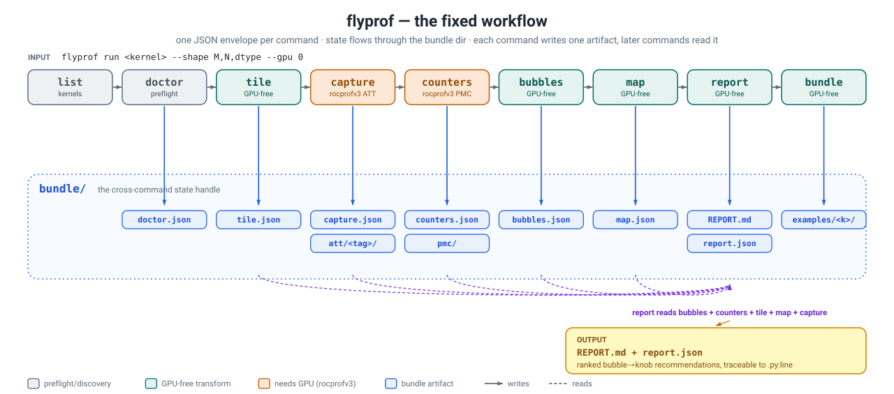
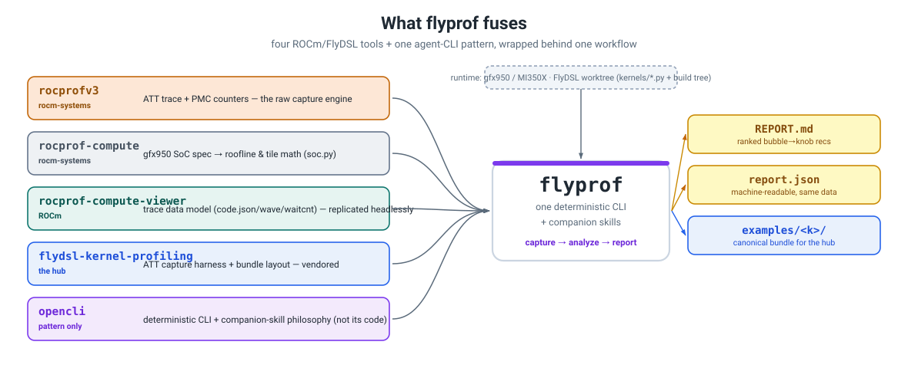
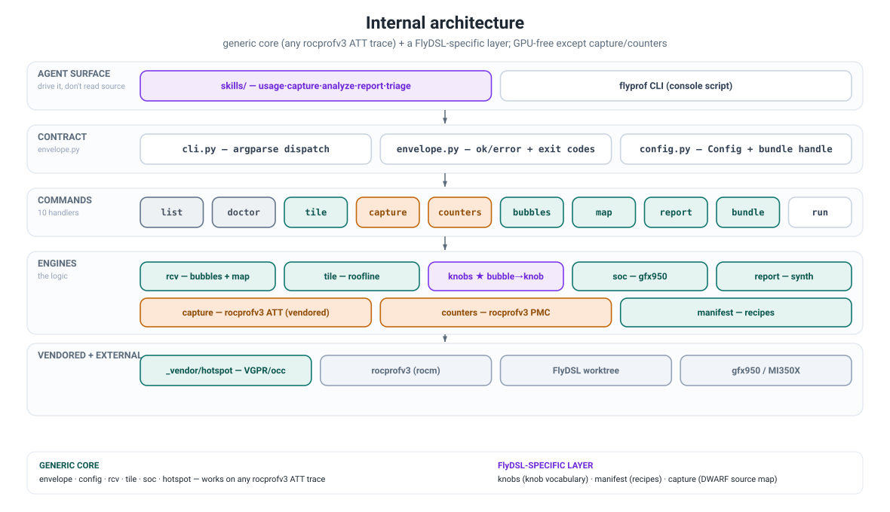
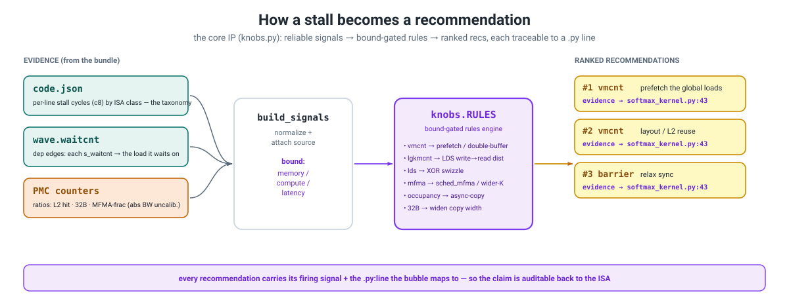

# flydsl-rocprof-cli  ·  `flyprof`

**The front half of FlyDSL kernel optimization on AMD CDNA (gfx950 / MI350X).**
Give it a kernel name; it runs `rocprofv3`, decodes the trace, and returns a complete
**instruction-level diagnosis** — every stall *bubble*, where it lives in the `.py`, and
which FlyDSL thread-level knob addresses it — as a stable JSON bundle + a `REPORT.md`.

It does **not** optimize the kernel. It produces the evidence to — and it is built to be
**driven by an agent**: one deterministic CLI, one JSON envelope per command, a clear
input→output at every step, paired with companion skills under [`skills/`](skills/).

<p align="center"></p>

---

## Quickstart

```bash
pip install -e .                                  # console script: flyprof  (dep: pyyaml)
flyprof doctor                                    # rocprofv3 / GPU / build-tree / soc → verdict: ready
flyprof list                                      # which kernels can I profile?
flyprof run softmax --shape 32768,8192,bf16 --gpu 0   # the whole pipeline → REPORT.md
```

Point at your FlyDSL checkout with `--worktree` (default `$FLYPROF_WORKTREE` or
`/sgl-workspace/FlyDSL-lab`). `flyprof run` is the convenience path; step through the
primitives when you want to inspect or re-run a single stage.

## The I/O contract

The whole tool is one shape: **input a kernel name, output one envelope, with state in a
bundle dir.** That's what makes it agent-drivable — every command is read the same way.

**Input** — `flyprof <command> [<kernel>] [--shape M,N[,K],dtype] [--gpu N] [--worktree PATH] [--bundle DIR] [--format json|table]`

**Output** — exactly one envelope on stdout, every command, every time:

```json
{ "ok": true,  "command": "capture", "bundle": "/abs/dir",
  "data": { …command-specific… }, "warnings": [], "truncated": {…}? }

{ "ok": false, "command": "capture",
  "error": { "code": "EMPTY_ATT", "exitCode": 66, "message": "…", "help": "…", "available": […] } }
```

- **State flows through the bundle dir** (see the diagram above): each command writes one
  JSON artifact; later commands read what earlier ones wrote.
- **Exit codes are sysexits-style and bound to `error.code`** — branch on the number, not
  the prose: `0` ok · `66` empty/no-match (*a result, not a bug*) · `69` rocprofv3/GPU
  missing (STOP) · `75` timeout (retry) · `78` bad config / missing build tree · `70` internal.

## Commands

| command | input → output | GPU? |
|---|---|---|
| `list` | worktree → profilable kernels (curated recipes ∪ synthesizable) | no |
| `doctor` | → rocprofv3 / GPU / build-tree / soc verdict | no |
| `tile` | shape + dtype + soc → recommended BM/BN/BK + LDS/VGPR/occupancy/roofline | **no** |
| `capture` | kernel → ATT bundle(s) + `capture.json` (dispatch, vgpr, occ, mapped%) | yes |
| `counters` | kernel → roofline / occupancy / L2 / LDS / tri-state bound | yes |
| `bubbles` | bundle → stall taxonomy by class + hotspots + waitcnt attribution | **no** |
| `map` | bundle → ISA ↔ `.py:line` + source snippets + flamegraph | **no** |
| `report` | bundle → ranked bubble→knob recommendations + `REPORT.md` / `report.json` | no |
| `bundle` | bundle → canonical `examples/<kernel>/` artifact | no |
| `run` | the full pipeline on one kernel | yes |

## What it fuses

`flyprof` isn't a new profiler — it wraps four ROCm/FlyDSL tools (and borrows opencli's
agent-CLI *pattern*) into a single workflow, so an agent never has to orchestrate them by hand.

<p align="center"></p>

## Internal architecture

A **generic core** (works on any rocprofv3 ATT trace) plus a thin **FlyDSL-specific layer**
(the knob vocabulary, recipe resolution, and DWARF source mapping). Everything is GPU-free
except `capture` and `counters`, which wrap `rocprofv3`.

<p align="center"></p>

## How a recommendation is made

`report` runs a rules engine ([`flyprof/knobs.py`](flyprof/knobs.py); full catalog in
[`skills/references/bubble-knob-table.md`](skills/references/bubble-knob-table.md)). Each
stall/bubble class → the diagnostic signal that fires it → the FlyDSL knob → the concrete
change, **gated by the roofline bound** and carrying **evidence** (the field that fired +
the `.py:line` the bubble maps to), so every claim is auditable back to the ISA.

<p align="center"></p>

**On honesty.** The bubble taxonomy and counter *ratios* (L2 hit, 32B-partial fraction,
MFMA fraction) are reliable and drive the decisions. Absolute HBM bandwidth from raw PMC
needs per-XCD/channel normalization we don't fully reproduce, so it's reported as a lower
bound flagged `calibrated: false` and **never used to decide the bound**.

## Examples

[`examples/`](examples/) holds real output bundles. The flagship is
[`examples/flash_attn_fwd/`](examples/flash_attn_fwd/) — FlyDSL's dual-wave
software-pipelined flash attention, the hardest operator: discovered live (the registry
recipe was stale), `arch_vgpr 249 → 4 waves/CU`, diagnosed **occupancy-capped** with the
root-cause fix ranked first (cut register footprint), traceable to `flash_attn_gfx950.py`.
A full ATT trace ships with it — load it with `flyprof bubbles/map --bundle examples/flash_attn_fwd`.

## Companion skills (for agents)

[`skills/`](skills/) holds the runbooks an agent follows — `flyprof-usage` (router) →
`flyprof-capture`, `flyprof-analyze`, `flyprof-report`, `flyprof-triage` — plus references
(`bubble-knob-table.md`, `rocprofv3-quirks.md`). Copy/symlink into `.claude/skills/` to register.

## Notes

- **Standalone.** The harness logic (`att_capture`, hotspot reg-pressure, …) is vendored +
  de-hardcoded here; no runtime dependency on `flydsl-kernel-profiling`. To publish a bundle
  into that hub, pass `--examples-dir <hub>/examples` (the default is repo-local `runs/examples/`).
- **Diagrams** are generated — edit [`docs/diagrams.py`](docs/diagrams.py) and run
  `python docs/diagrams.py` to regenerate the SVGs (they stay aligned and track the command surface).
- **Validated** on MI350X/gfx950 (rocprofv3 1.1.0): `flyprof run softmax` → memory-bound,
  vmcnt-dominated (49% of 77% stall) → "software-prefetch / double-buffer the global loads,"
  traceable to `softmax_kernel.py`. `pytest tests/` (19 tests) exercises the tile math, the
  headless bubble taxonomy + ISA↔source map (committed fixture), the knob rules, and the
  envelope contract — no GPU needed.
```
flyprof run softmax → bound: memory · rank-1: vmcnt → prefetch · @ softmax_kernel.py:43
```
